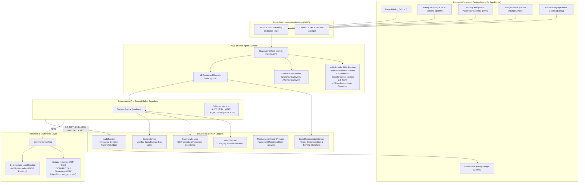

<p align="center">
  
</p>

# NOVA — Autonomous Household Commerce Agent

> **The intelligence layer for everyday commerce and household autonomy.**  
> Built for the **AWS Agents for Humans Hackathon** · Track 1: *Everyday Agents*

[](https://youtu.be/zKYA4fBOfJ0)

<p align="center">
  <strong><a href="https://youtu.be/zKYA4fBOfJ0">Watch the Full End-to-End Walkthrough Video (5:31)</a></strong><br/>
  <em>See NOVA autonomously replenish essentials, deliberately restrain spending when stock is healthy, and reconcile cooking meal intents against live pantry inventory.</em>
</p>

---

## Executive Summary

Everyday life carries a relentless cognitive burden: tracking milk, checking oil levels, reordering staples, comparing quick-commerce delivery fees, and balancing monthly household budgets. Most smart shopping apps merely automate clicks: they schedule rigid recurring deliveries whether you need them or not, or provide conversational chatbots that lack real safety boundaries and attempt to buy products with hallucinated data.

**NOVA** introduces a fundamentally different paradigm: **true contextual autonomy**.

Built on the **AWS Strands Agents SDK** and **Amazon Bedrock**, NOVA operates quietly in the background as an everyday household agent. It continuously monitors pantry stock levels, calculates real daily consumption rates, enforces strict deterministic budget guardrails, and only interrupts the user when an explicit decision is required.

### Core Architectural Principle: Autonomy != Automation

NOVA is not an unrestricted chatbot with a credit card. It strictly decouples **probabilistic reasoning** (natural language understanding, activity decomposition, and context synthesis) from **deterministic execution** (budget math, policy validation, and commerce checkout).

```
+-------------------------------------------------------------------------------+
|                       PROBABILISTIC REASONING (LLM)                           |
|   Understands context, decomposes meal intents, identifies needed products.   |
+---------------------------------------+---------------------------------------+
                                        | Proposes Purchase Action
                                        v
+-------------------------------------------------------------------------------+
|                     DETERMINISTIC PRE-COMMIT SAFETY GATE                      |
|                     (DecisionEngine & Domain Services)                        |
|                                                                               |
|   1. Category Policy Check      -> Restricted?        -> BLOCKED (Abort)      |
|   2. Live Inventory Stock       -> Ample Supply?      -> DO_NOTHING (Restrain)|
|   3. Approval Requirements      -> Ask-Only Category? -> ASK (Await Human)    |
|   4. Budget & Price Headroom    -> Over Ceiling?      -> ASK (Await Human)    |
|   5. Timing & Price Signals     -> Elevated Price?    -> WAIT (Defer Order)   |
|   6. Epistemic Confidence       -> Score < 0.70?      -> ASK (Await Human)    |
|   7. Autonomy Stance            -> Not Full Autopilot?-> ASK (Await Human)    |
+---------------------------------------+---------------------------------------+
                                        | If All 7 Gates Pass Cleanly
                                        v
+-------------------------------------------------------------------------------+
|                        DETERMINISTIC COMMERCE EXECUTION                       |
|   Swiggy Instamart Model Context Protocol (MCP) / Verified Catalog Checkout   |
+-------------------------------------------------------------------------------+
```

---

## System Architecture


*Presentation Architecture Diagram. Vector SVG, Interactive HTML Viewer, and PNG formats available in [docs/](docs/).*

### System Data Flow



---

## The Three Verified Hero Scenarios

Every scenario is backed by automated tests in `backend/tests/test_agent_scenarios.py` and runs identically in live interactive sessions:

### Scenario 1: Predictive Restock (`AUTO`)
*Autonomous daily replenishment of everyday essentials within strict limits.*
- **Context**: The household regularly consumes milk. Live pantry inventory tracks Amul Taaza Milk 1L at `0.3L` remaining, with a measured Daily Consumption Rate (DCR) of `0.6L/day` (`0.5 days of supply remaining`). Status: `LOW`.
- **Evaluation**:
  1. Category check: `Milk` is configured in `automatic_categories`.
  2. Inventory check: Stock is below the 7-day safety threshold.
  3. Budget check: Product price (₹68) is well within the ₹500 auto-buy limit and monthly budget headroom (₹1,560 remaining).
  4. Confidence check: Data freshness confidence is 97%.
- **Outcome**: `AUTO` verdict. NOVA dispatches the purchase order, deducts ₹68 from the monthly budget, updates pantry stock to healthy, and logs an explainable audit record: *"Inventory was low (0.5 days remaining), within auto-buy limit (₹68 <= ₹500), category allowed. Autonomous purchase executed."*

### Scenario 2: Intelligent Restraint (`DO_NOTHING`)
*Knowing when NOT to spend is the true mark of everyday intelligence.*
- **Context**: The user queries pantry status or the background autopilot evaluates household cooking oils. Fortune Sunflower Oil 5L has `2.1L` remaining in stock, with a DCR of `0.07L/day` (`30 days of supply remaining`). Status: `HEALTHY`.
- **Evaluation**: The deterministic decision engine inspects inventory: `needs_replenishment("Oil")` returns `False` because the household has 30 days of stock remaining.
- **Outcome**: `DO_NOTHING` verdict. NOVA deliberately refuses to make a purchase, preserving the household's capital: *"You still have 2.1L of Fortune Sunflower Oil in your pantry (~30 days of supply). No purchase needed."* The restraint decision is committed to the audit trail as proof of prudence.

### Scenario 3: Intent Reconciliation (`RECONCILE` -> `AUTO`)
*Natural language meal planning without duplicate purchases.*
- **Context**: The user tells NOVA: *"I want to make Maggi tonight."*
- **Evaluation**:
  1. NOVA decomposes the meal into required ingredients: instant noodles, cooking oil, and salt.
  2. NOVA cross-references the live pantry: Fortune Sunflower Oil (2.1L) and Tata Salt (0.4kg) are already in healthy stock.
  3. NOVA isolates that only the Maggi 2-Minute Noodles 280g pack is missing from the household.
- **Outcome**: Rather than ordering a redundant grocery bundle, NOVA filters out stocked items and executes an `AUTO` order strictly for the missing noodles (₹55), keeping the entire meal preparation within budget.

---

## Autonomy and Safety Specification

NOVA guarantees five deterministic outcomes for any proposed household action:

| Decision State | Trigger Condition | System Action | Human Experience |
| :--- | :--- | :--- | :--- |
| **`AUTO`** | Low stock, category whitelisted, price <= auto-limit (₹500), within monthly budget, confidence >= 0.70, Autopilot ON. | Executes checkout, updates pantry, deducts budget, logs audit trail. | *"Taken care of automatically."* Visible in Recently Taken Care Of with complete "Why?" breakdown. |
| **`ASK`** | Price > ₹500, or category in `ask_categories`, or budget tight, or low confidence, or Autopilot OFF. | Halts checkout, creates pending authorization card, holds cart. | *"Needs your approval."* One-click Approve or Dismiss in command center. |
| **`WAIT`** | Price elevated (> 8% above historical avg) while pantry has >= 7 days of supply remaining. | Defers order, schedules re-check on price drop. | *"Waiting for better price."* Explains savings opportunity and days remaining. |
| **`DO_NOTHING`** | Item has ample inventory in pantry (> 7 days remaining). | Commits zero spend, updates audit ledger with restraint record. | *"You still have 30 days of supply. Left alone."* Prevents pantry clutter and waste. |
| **`BLOCKED`** | Category in `restricted_categories` (e.g. Alcohol, Tobacco). | Absolute abort. Never purchases or prompts. | *"Can't do this under your rules."* Enforces household safety policies. |

---

## AWS Agents for Humans Hackathon Alignment

NOVA was purpose-built for the **AWS Agents for Humans Hackathon** under **Track 1: Everyday Agents**:

> *"Track 1: Everyday Agents — Build an agent that takes the busywork out of daily life, home, money, health, errands, family. The best ones run quietly in the background and only ping you when there's a real decision to make."*

### Judging Criteria Mapping

| Hackathon Criterion | Weight | How NOVA Delivers | Implementation Proof |
| :--- | :--- | :--- | :--- |
| **Technological Implementation** | 20% | Built on the **AWS Strands Agents SDK** (`from strands import Agent`), utilizing Bedrock Claude 3.5 Sonnet, 15 typed `@tool` declarations, streaming telemetry hooks (`BeforeToolCallEvent`, `AfterToolCallEvent`), and Model Context Protocol (MCP) client. | [`backend/agent/nova_agent.py`](backend/agent/nova_agent.py), [`backend/agent/tools.py`](backend/agent/tools.py) |
| **Design & User Experience** | 20% | Calm, premium consumer command center built with Next.js 14 and Tailwind CSS. Avoids aggressive sci-fi AI tropes; uses human terms ("Taken care of", "Needs your input", "Left alone"), with a transparent "Why?" explanation modal for every action. | [`frontend/app/`](frontend/app/), 24 static prerendered routes, zero TypeScript errors. |
| **Potential Impact** | 20% | Addresses the invisible mental load of everyday grocery management and micro-spending that affects millions of households daily. Saves time, prevents food waste, and enforces financial discipline. | Measured DCR velocity, savings tracking, and automated budget forecasting in [`backend/autopilot/`](backend/autopilot/). |
| **Creativity & Originality** | 20% | The concept of **intelligent restraint (`DO_NOTHING`)** and **ingredient reconciliation** sets NOVA apart from reactive chatbots. NOVA proves that a great everyday agent knows when *not* to act. | [`test_hero_2_oil_restraint`](backend/tests/test_agent_scenarios.py), [`backend/intent/intent_service.py`](backend/intent/intent_service.py) |
| **Presentation Quality** | 20% | Complete, clear 5-minute video walkthrough showcasing all hero scenarios, live copilot command streaming, policy enforcement, and audit logs. | [YouTube Demo Video](https://youtu.be/zKYA4fBOfJ0) (5:31) |

---

<details>
<summary><strong>Deep Dive 1: Consumption Velocity & Epistemic Confidence Model</strong></summary>

### Daily Consumption Rate (DCR) Math
NOVA computes inventory depletion using measured daily consumption velocity:
$$\text{Days Remaining} = \frac{\text{Current Quantity}}{\text{Daily Consumption Rate (DCR)}}$$

If $\text{DCR} \le 0$, the item is treated as non-depleting ($\text{Days Remaining} = 99.0$).

### Multi-Factor Confidence Scoring
Rather than assuming perfect inventory accuracy, NOVA calculates an epistemic confidence score ($0.30 \le C \le 0.98$):
- **Base Score**: $0.70$
- **Freshness Bonus/Penalty**:
  - Updated $< 1$ hour ago: $+0.15$
  - Updated $< 24$ hours ago: $+0.10$
  - Updated $< 72$ hours ago: $+0.05$
  - Stale ($> 72$ hours): $-0.10$
- **Preference Bonus**: Frequently tracked item $+0.08$
- **Depletion Uncertainty Penalty**: Quantity $\le 0$: $-0.10$
- **Active DCR Defined**: $+0.05$

Confidence directly controls autonomy: if $C < 0.70$, the agent is strictly prohibited from `AUTO` purchases and is forced to `ASK`.
</details>

<details>
<summary><strong>Deep Dive 2: Swiggy Instamart Model Context Protocol (MCP) Client</strong></summary>

NOVA's commerce engine implements the official **Model Context Protocol (MCP)** specification via JSON-RPC 2.0 over Streamable HTTP:
- **Server Endpoint**: `https://mcp.swiggy.com/im`
- **Authentication**: OAuth 2.1 with Proof Key for Code Exchange (PKCE) token manager.
- **Implemented MCP Tools**: `search_products`, `update_cart`, and `checkout`.
- **Fault-Tolerant Circuit Breaker**: If the live MCP endpoint rate-limits or returns non-JSON payloads, the circuit breaker automatically trips for 60 seconds and smoothly routes requests to the verified local catalog (`products.json`, 64 products). Zero user disruption.
</details>

<details>
<summary><strong>Deep Dive 3: The 15 Registered Strands Agent Tools</strong></summary>

Every tool is defined using `@tool` from the AWS Strands Agents SDK:
1. `get_pantry_inventory`: Inspects household stock levels and identifies LOW vs HEALTHY items.
2. `get_purchase_history`: Retrieves recurring purchase habits and typical intervals from household memory.
3. `get_household_overview`: Returns unified executive metrics (budget balance, low stock count, active reminders).
4. `get_budget_status`: Returns total budget, spent balance, auto-buy limit, and spending pressure status.
5. `check_category_policy`: Evaluates category governance rules (automatic, ask-required, or restricted).
6. `search_catalog`: Queries Swiggy Instamart live MCP or catalog for product matches.
7. `compare_product_offers`: Compares real-time pricing and delivery across quick-commerce providers.
8. `reconcile_activity_requirements`: Decomposes natural language meal requests and isolates missing ingredients.
9. `record_restraint_decision`: Commits a `DO_NOTHING` verdict to the audit trail when stock is sufficient.
10. `evaluate_and_execute_purchase`: Passes proposed orders through the deterministic decision gate before checkout.
11. `manage_household_reminder`: Manages smart reminders (create, snooze, dismiss, complete).
12. `update_household_policy`: Configures category whitelists, auto thresholds, and blocklists.
13. `update_pantry_stock`: Updates item quantity, unit, and status in the persistent pantry ledger.
14. `report_item_depleted`: Marks an item quantity to 0 and flags status as LOW for replenishment.
15. `get_price_watch_items`: Analyzes market pricing for price drops and wait opportunities.
</details>

---

## Quickstart & Local Installation Guide

NOVA operates completely locally out of the box. No active AWS credentials or external API keys are required to explore all features and run the verification test suite.

### Prerequisites
- **Python 3.10+** (tested on Python 3.12 and 3.13)
- **Node.js 18+** (tested on Node.js 20 and 22)
- **npm** or **pnpm**

### 1. Set Up the Backend

```bash
# Navigate to the backend directory
cd backend

# Create and activate a Python virtual environment
python -m venv venv

# Windows (PowerShell)
.\venv\Scripts\Activate.ps1

# Linux / macOS
source venv/bin/activate

# Install backend dependencies
pip install -r requirements.txt

# Start the FastAPI orchestration server
python -m uvicorn api.main:app --reload --port 8000
```

FastAPI server runs at `http://localhost:8000`. Interactive OpenAPI documentation is available at `http://localhost:8000/docs`.

### 2. Set Up the Frontend

```bash
# In a new terminal window, navigate to the frontend directory
cd frontend

# Install frontend dependencies
npm install

# Start the Next.js development server
npm run dev
```

Next.js frontend runs at `http://localhost:3000`.

### 3. Automated Verification

Run the comprehensive 32-test backend verification suite:

```bash
# From repository root
python -m pytest backend/tests/ -v
```

Expected output:
```text
============================== 32 passed in 3.42s ==============================
```

Verify frontend compilation and static route generation:

```bash
cd frontend
npm run build
```

Expected output:
```text
✓ Generating static pages (24/24)
✓ Finalizing page optimization
Exit Code: 0
```

---

## Environment Configuration

Copy `.env.example` to `.env` to configure optional model and commerce providers:

```bash
cp .env.example .env
```

| Variable | Description | Default | Fallback Behavior |
| :--- | :--- | :--- | :--- |
| `LLM_PROVIDER` | Active LLM driver (`bedrock`, `gemini`) | `gemini` | Offline deterministic tool dispatcher |
| `GEMINI_API_KEY` | Google Gemini API key | Optional | Offline deterministic tool dispatcher |
| `GEMINI_MODEL` | Gemini model variant | `gemini-2.5-flash` | Standard flash model |
| `AWS_REGION` | AWS Region for Amazon Bedrock / Strands | `us-east-1` | Standard Bedrock region |
| `BEDROCK_MODEL_ID` | Amazon Bedrock Claude model ID | `anthropic.claude-3-5-sonnet-20241022-v2:0` | Bedrock default |
| `COMMERCE_MODE` | Commerce connector (`live` or `mock`) | `live` | Simulated catalog if unauthenticated |
| `SWIGGY_MCP_URL` | Upstream Swiggy Instamart MCP endpoint | `https://mcp.swiggy.com/im` | Circuit breaker to local catalog |
| `DEFAULT_AUTONOMY_PROFILE` | Autonomy stance (`FULL_AUTOPILOT`, `ASK_EVERYTHING`, `RESTRICTIVE`) | `FULL_AUTOPILOT` | `FULL_AUTOPILOT` |
| `PORT` | FastAPI backend port | `8000` | Port 8000 |

---

## Repository Structure

```text
Nova/
├── backend/
│   ├── agent/             # AWS Strands Agent (nova_agent.py) & 15 tools (tools.py)
│   ├── ai/                # LLM client abstractions (Bedrock & Gemini)
│   ├── amazon/            # Household memory provider & price intelligence service
│   ├── api/               # FastAPI gateway, routes, CORS, streaming SSE endpoints
│   ├── audit/             # Immutable decision audit trail service
│   ├── autopilot/         # Monthly replenishment planner & sweep cycles
│   ├── budget/            # Monthly spend ledger & auto-buy limits
│   ├── catalog/           # Product repository, taxonomy, & 64-item verified catalog
│   ├── commerce/          # Swiggy Instamart MCP adapter, OAuth 2.1 PKCE, mock adapter
│   ├── decision/          # Deterministic DecisionEngine (AUTO, ASK, WAIT, DO_NOTHING, BLOCKED)
│   ├── images/            # Product image resolver & caching pipeline
│   ├── intent/            # Natural language recipe deconstruction & ingredient scaler
│   ├── inventory/         # Pantry inventory ledger & DCR consumption model
│   ├── policy/            # Category autonomy rules & restriction gates
│   ├── reminders/         # Household reminder lifecycle engine
│   ├── savings/           # Savings opportunities & price drop detector
│   ├── user/              # User session state & autonomy profile manager
│   └── tests/             # 32-test pytest verification suite
├── docs/                  # Technical documentation, Bedrock AgentCore mapping, setup guides
├── frontend/
│   ├── app/               # Next.js 14 App Router (24 static prerendered routes)
│   ├── components/        # UI components: Copilot, Today, Storefront, Cards, Nav
│   └── public/            # Logo, static product assets, and icons
├── .env.example           # Documented configuration template
├── .gitignore             # Git ignore protecting secrets, virtualenvs, and builds
├── LICENSE                # Open Source MIT License
├── logo.png               # Official NOVA Brand Mark
└── README.md              # Project documentation and submission guide
```

---

## License & Security Assurance

- **Open Source License**: Released under the [MIT License](LICENSE) in compliance with the AWS Agents for Humans Hackathon requirements.
- **Credential Safety**: No private keys, AWS access tokens, or live credentials are committed. All environment secrets are managed strictly through `.env` (enforced via `.gitignore`).
- **Autonomous Spend Boundary**: NOVA cannot execute transactions without passing all 7 deterministic pre-commit safety checks.
