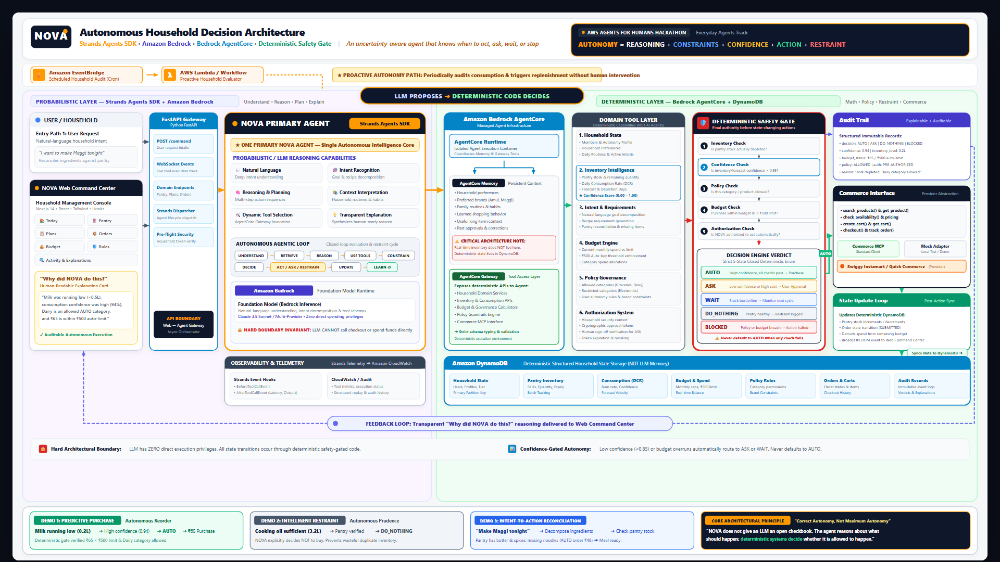
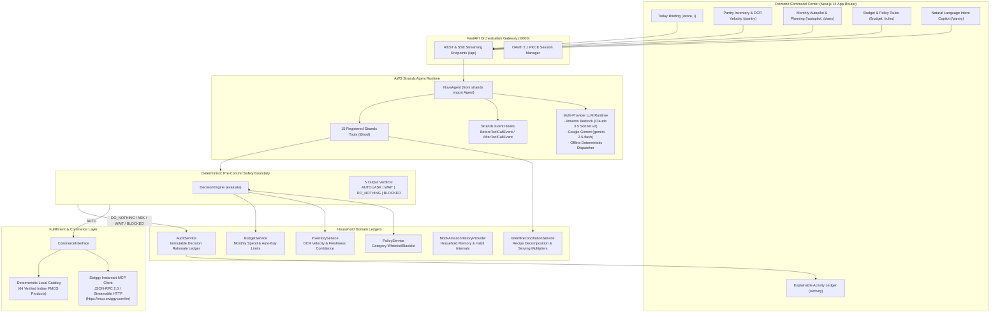

<p align="center">
  
</p>

<h1 align="center">NOVA: Autonomous Household Commerce Agent</h1>

<p align="center">
  <strong>The intelligence layer for everyday commerce and household autonomy.</strong><br />
  Built for the <strong>AWS Agents for Humans Hackathon</strong> (Track 1: Everyday Agents)
</p>

<p align="center">
  <a href="https://youtu.be/zKYA4fBOfJ0"></a>
  <a href="https://awsagentsforhumans.devpost.com/"></a>
  <a href="backend/agent/nova_agent.py"></a>
  <a href="backend/ai/ai_service.py"></a>
  <a href="backend/ai/gemini_provider.py"></a>
  <a href="backend/commerce/swiggy_adapter.py"></a>
  <a href="backend/api/main.py"></a>
  <a href="frontend/"></a>
  <a href="backend/tests/"></a>
  <a href="LICENSE"></a>
</p>

---

## Video Walkthrough & Live Demonstration

<div align="center">
  <video src="https://github.com/SanTiwari07/Nova/raw/main/NOVA_Household_Autopilot_Hackathon_Demo.mp4" controls width="100%" poster="https://img.youtube.com/vi/zKYA4fBOfJ0/maxresdefault.jpg" style="max-width: 900px; border-radius: 8px;">
    <source src="NOVA_Household_Autopilot_Hackathon_Demo.mp4" type="video/mp4" />
    <p>Your browser does not support the video tag. You can <a href="NOVA_Household_Autopilot_Hackathon_Demo.mp4">download the raw MP4 directly</a> or <a href="https://youtu.be/zKYA4fBOfJ0">watch on YouTube</a>.</p>
  </video>
</div>

<p align="center">
  <strong><a href="https://youtu.be/zKYA4fBOfJ0">Watch on YouTube (1080p HD, 5:31)</a></strong> | 
  <strong><a href="https://github.com/SanTiwari07/Nova/raw/main/NOVA_Household_Autopilot_Hackathon_Demo.mp4">Direct MP4 Playback / Download</a></strong>
</p>

<details open>
<summary><strong>Interactive Video Chapter Index (Click to Jump)</strong></summary>

| Timestamp | Segment Title | Core Architectural Focus |
| :--- | :--- | :--- |
| **[00:00](https://youtu.be/zKYA4fBOfJ0?t=0)** | Executive Pitch & Cognitive Load | Problem space: the invisible daily burden of household inventory and micro-spending |
| **[00:45](https://youtu.be/zKYA4fBOfJ0?t=45)** | Probabilistic vs Deterministic Safety | Architecture overview: AWS Strands runtime decoupled from the pre-commit safety gate |
| **[01:20](https://youtu.be/zKYA4fBOfJ0?t=80)** | Hero Scenario 1: Predictive Restock (`AUTO`) | Autonomous milk reordering triggered by live consumption velocity (DCR) and safety checks |
| **[02:35](https://youtu.be/zKYA4fBOfJ0?t=155)** | Hero Scenario 2: Intelligent Restraint (`DO_NOTHING`) | Deliberate spend refusal: preserving capital when pantry stock (cooking oil) is healthy |
| **[03:45](https://youtu.be/zKYA4fBOfJ0?t=225)** | Hero Scenario 3: Natural Language Intent (`RECONCILE`) | "I want to make Maggi tonight" reconciled against pantry stock to buy only missing items |
| **[04:30](https://youtu.be/zKYA4fBOfJ0?t=270)** | Household Governance & Explainable Audit | Monthly Autopilot planning, category policy rules, and transparent rationale cards |
| **[05:15](https://youtu.be/zKYA4fBOfJ0?t=315)** | Verification & Conclusion | 32-test automated suite execution, zero-hallucination guarantee, and hackathon recap |

</details>

---

## Interactive Navigation Matrix

| Topic | Direct Anchor | Quick Description |
| :--- | :--- | :--- |
| **Executive Summary** | [Jump to Summary](#executive-summary) | Why autonomy differs fundamentally from blind click automation |
| **Core Architecture Principle** | [Jump to Principle](#core-architectural-principle-autonomy--automation) | Decoupling LLM probabilistic reasoning from deterministic safety gates |
| **Hero Scenarios** | [Jump to Hero Scenarios](#the-three-verified-hero-scenarios) | Interactive traces for `AUTO`, `DO_NOTHING`, and `RECONCILE` |
| **5-Verdict Decision Engine** | [Jump to Decision Engine](#autonomy-and-safety-specification) | Exact rules for `AUTO`, `ASK`, `WAIT`, `DO_NOTHING`, `BLOCKED` |
| **System Architecture** | [Jump to Architecture](#system-architecture) | Full presentation diagram, Mermaid data flow, and subsystem breakdown |
| **Technical Deep Dives** | [Jump to Deep Dives](#technical-deep-dives) | DCR velocity math, epistemic confidence scoring, and MCP client |
| **Strands Agent Tools** | [Jump to Tools](#strands-agent-tools-catalog) | Interactive 15-tool inventory and schema definition |
| **Quickstart Guide** | [Jump to Quickstart](#quickstart--local-installation-guide) | Step-by-step local reproduction for backend, frontend, and test suite |
| **Hackathon Alignment** | [Jump to Hackathon](#aws-agents-for-humans-hackathon-alignment) | Track 1 Everyday Agents judging criteria mapping (20% weight per pillar) |

---

## Executive Summary

Everyday life carries a relentless cognitive burden: tracking milk, checking oil levels, reordering staples, comparing quick-commerce delivery fees, and balancing monthly household budgets. Most smart shopping apps merely automate clicks: they schedule rigid recurring deliveries whether you need them or not, or provide conversational chatbots that lack real safety boundaries and attempt to buy products with hallucinated data.

**NOVA** introduces a fundamentally different paradigm: **true contextual autonomy**.

Built on the **AWS Strands Agents SDK** and **Amazon Bedrock**, NOVA operates quietly in the background as an everyday household agent. It continuously monitors pantry stock levels, calculates real daily consumption rates, enforces strict deterministic budget guardrails, and only interrupts the user when an explicit decision is required.

### Core Architectural Principle: Autonomy != Automation

NOVA is not an unrestricted chatbot with a credit card. It strictly decouples **probabilistic reasoning** (natural language understanding, activity decomposition, and context synthesis) from **deterministic execution** (budget math, policy validation, and commerce checkout).

```
+-------------------------------------------------------------------------------+
|                       PROBABILISTIC REASONING (LLM)                           |
|   Understands context, decomposes meal intents, identifies needed products.   |
+---------------------------------------+---------------------------------------+
                                        | Proposes Purchase Action
                                        v
+-------------------------------------------------------------------------------+
|                     DETERMINISTIC PRE-COMMIT SAFETY GATE                      |
|                     (DecisionEngine & Domain Services)                        |
|                                                                               |
|   1. Category Policy Check      -> Restricted?        -> BLOCKED (Abort)      |
|   2. Live Inventory Stock       -> Ample Supply?      -> DO_NOTHING (Restrain)|
|   3. Approval Requirements      -> Ask-Only Category? -> ASK (Await Human)    |
|   4. Budget & Price Headroom    -> Over Ceiling?      -> ASK (Await Human)    |
|   5. Timing & Price Signals     -> Elevated Price?    -> WAIT (Defer Order)   |
|   6. Epistemic Confidence       -> Score < 0.70?      -> ASK (Await Human)    |
|   7. Autonomy Stance            -> Not Full Autopilot?-> ASK (Await Human)    |
+---------------------------------------+---------------------------------------+
                                        | If All 7 Gates Pass Cleanly
                                        v
+-------------------------------------------------------------------------------+
|                        DETERMINISTIC COMMERCE EXECUTION                       |
|   Swiggy Instamart Model Context Protocol (MCP) / Verified Catalog Checkout   |
+-------------------------------------------------------------------------------+
```

---

## The Three Verified Hero Scenarios

Every scenario is backed by automated tests in `backend/tests/test_agent_scenarios.py` and runs identically in live interactive sessions. Click each card below to inspect the detailed execution trace.

<details open>
<summary><strong>Hero Scenario 1: Predictive Restock (Decision: AUTO)</strong></summary>
<br />

*Autonomous daily replenishment of everyday essentials within strict limits.*

- **Context**: The household regularly consumes milk. Live pantry inventory tracks Amul Taaza Milk 1L at `0.3L` remaining, with a measured Daily Consumption Rate (DCR) of `0.6L/day` (`0.5 days of supply remaining`). Inventory status: `LOW`.
- **Pre-Commit Safety Gate Evaluation**:
  1. *Category Check*: `Milk` is listed in `automatic_categories`. Passed.
  2. *Inventory Check*: Stock is below the 7-day safety threshold (0.5 days remaining). Replenishment required.
  3. *Budget Check*: Product price (Rs 68) is well within the Rs 500 auto-buy limit and monthly budget headroom (Rs 1,560 remaining). Passed.
  4. *Confidence Check*: Data freshness confidence is 97% (exceeds the 70% epistemic confidence threshold). Passed.
  5. *Autonomy Profile*: Active stance is `FULL_AUTOPILOT`. Passed.
- **Outcome**: `AUTO` verdict. NOVA dispatches the purchase order, deducts Rs 68 from the monthly budget, updates pantry stock to healthy, and logs an explainable audit record.
- **Audit Ledger Record**:
  ```json
  {
    "action": "evaluate_and_execute_purchase",
    "verdict": "AUTO",
    "item": "Amul Taaza Milk 1L",
    "price": 68.0,
    "rationale": "Inventory was low (0.5 days remaining), within auto-buy limit (Rs 68 <= Rs 500), category allowed. Autonomous purchase executed."
  }
  ```
- **Human Experience**: "Milk was running low, so I took care of it." Appears under *Recently Taken Care Of* with a full "Why?" breakdown modal.

</details>

<details open>
<summary><strong>Hero Scenario 2: Intelligent Restraint (Decision: DO_NOTHING)</strong></summary>
<br />

*Knowing when NOT to spend is the true mark of everyday intelligence.*

- **Context**: The user queries pantry status or the background autopilot evaluates household cooking oils. Fortune Sunflower Oil 5L has `2.1L` remaining in stock, with a measured DCR of `0.07L/day` (`30 days of supply remaining`). Inventory status: `HEALTHY`.
- **Pre-Commit Safety Gate Evaluation**:
  1. The deterministic decision engine inspects inventory: `needs_replenishment("Oil")` returns `False` because the household has 30 days of stock remaining.
  2. Price and discount signals are checked; no urgency exists that justifies overstocking.
- **Outcome**: `DO_NOTHING` verdict. NOVA deliberately refuses to make a purchase, preserving the household's capital.
- **Audit Ledger Record**:
  ```json
  {
    "action": "record_restraint_decision",
    "verdict": "DO_NOTHING",
    "item": "Fortune Sunlite Sunflower Oil 5L",
    "days_remaining": 30.0,
    "rationale": "You still have 2.1L of Fortune Sunflower Oil in your pantry (~30 days of supply). No purchase needed."
  }
  ```
- **Human Experience**: "You still have enough cooking oil for about 30 days, so I left it alone." Visible in *Left Alone*, proving intentional restraint.

</details>

<details open>
<summary><strong>Hero Scenario 3: Intent Reconciliation (Decision: RECONCILE -> AUTO)</strong></summary>
<br />

*Natural language meal planning without duplicate purchases.*

- **Context**: The user tells NOVA: *"I want to make Maggi tonight."*
- **Reasoning & Reconciliation Trace**:
  1. *Decomposition*: NOVA's probabilistic LLM identifies required ingredients for Maggi: instant noodles, cooking oil, and salt.
  2. *Pantry Reconciliation*: NOVA cross-references the live pantry ledger: Fortune Sunflower Oil (2.1L) and Tata Salt (0.4kg) are already in healthy stock.
  3. *Diff Isolation*: NOVA computes that only the Maggi 2-Minute Noodles 280g pack is missing from the household.
  4. *Safety Evaluation*: The single missing product is Rs 55 (below the Rs 500 auto-buy ceiling) and in an approved category.
- **Outcome**: Rather than ordering a redundant grocery bundle, NOVA filters out stocked items and executes an `AUTO` order strictly for the missing noodles (Rs 55), keeping the entire meal preparation within budget.
- **Human Experience**: The UI presents the transparent plan: "Maggi 2-Minute Noodles missing for tonight. Ordered automatically for Rs 55 (Oil and Salt already in pantry)."

</details>

---

## Autonomy and Safety Specification

NOVA guarantees five deterministic outcomes for any proposed household action:

| Decision State | Trigger Condition | System Action | Human Experience |
| :--- | :--- | :--- | :--- |
| **`AUTO`** | Low stock, category whitelisted, price <= auto-limit (Rs 500), within monthly budget, confidence >= 0.70, Autopilot ON. | Executes checkout, updates pantry, deducts budget, logs audit trail. | *"Taken care of automatically."* Visible in Recently Taken Care Of with complete "Why?" breakdown. |
| **`ASK`** | Price > Rs 500, or category in `ask_categories`, or budget tight, or low confidence, or Autopilot OFF. | Halts checkout, creates pending authorization card, holds cart. | *"Needs your approval."* One-click Approve or Dismiss in command center. |
| **`WAIT`** | Price elevated (> 8% above historical avg) while pantry has >= 7 days of supply remaining. | Defers order, schedules re-check on price drop. | *"Waiting for better price."* Explains savings opportunity and days remaining. |
| **`DO_NOTHING`** | Item has ample inventory in pantry (> 7 days remaining). | Commits zero spend, updates audit ledger with restraint record. | *"You still have 30 days of supply. Left alone."* Prevents pantry clutter and waste. |
| **`BLOCKED`** | Category in `restricted_categories` (e.g. Alcohol, Tobacco). | Absolute abort. Never purchases or prompts. | *"Can't do this under your rules."* Enforces household safety policies. |

<details>
<summary><strong>Interactive Breakdown of the 5 Decision State Verifiable Contracts</strong></summary>
<br />

#### 1. `AUTO` Contract
- **Trigger Logic**: `days_remaining <= 7.0` AND `category in automatic_categories` AND `price <= auto_buy_limit` AND `price <= remaining_monthly_budget` AND `confidence >= 0.70` AND `autonomy_profile == FULL_AUTOPILOT`.
- **System Behavior**: Commits commerce checkout via MCP, decreases budget balance, increments pantry stock upon fulfillment, and writes immutable audit entry.
- **Safety Boundary**: Zero-human-intervention path is mathematically bounded by the monthly spend ceiling.

#### 2. `ASK` Contract
- **Trigger Logic**: `price > auto_buy_limit` OR `category in ask_categories` OR `price > remaining_monthly_budget` OR `confidence < 0.70` OR `autonomy_profile != FULL_AUTOPILOT`.
- **System Behavior**: Builds a pending authorization card in the frontend, creates a cart reservation, and halts execution until the human provides an explicit approval signal.

#### 3. `WAIT` Contract
- **Trigger Logic**: `price > historical_average * 1.08` AND `days_remaining >= 7.0`.
- **System Behavior**: Suspends ordering, logs price delta to the price watch ledger, and monitors future pricing sweeps. Protects household against dynamic surge pricing.

#### 4. `DO_NOTHING` Contract
- **Trigger Logic**: `days_remaining > 7.0` AND no explicit human depletion override.
- **System Behavior**: Aborts purchase pipeline immediately. Writes a restraint justification to the audit ledger to prove proactive vigilance without unnecessary spending.

#### 5. `BLOCKED` Contract
- **Trigger Logic**: `category in restricted_categories` OR `product_flags contains RESTRICTED`.
- **System Behavior**: Permanent termination of intent. The agent does not prompt the user for permission, strictly preventing policy circumvention.

</details>

---

## System Architecture

<p align="center">
  <a href="docs/nova_system_architecture.png">
    
  </a><br />
  <em>Presentation Architecture Diagram: Built for the AWS Agents for Humans Hackathon (Track 1: Everyday Agents).</em><br />
  <em>Formats: <a href="docs/nova_system_architecture.svg">Vector SVG</a> | <a href="docs/nova_system_architecture.html">Interactive HTML Viewer</a> | <a href="docs/nova_system_architecture.png">High-Res PNG</a></em>
</p>

### System Data Flow



<details>
<summary><strong>Explore the 6 Architectural Subsystems</strong></summary>
<br />

1. **Frontend Command Center (`frontend/app/`)**: Next.js 14 App Router application with 24 static prerendered routes, zero TypeScript compile errors, and calm, non-intrusive consumer UX. Features dedicated interfaces for Daily Briefings, Pantry Velocity, Monthly Autopilot, Household Governance, Intent Copilot, and Audit Trails.
2. **FastAPI Orchestration Gateway (`backend/api/`)**: High-throughput asynchronous gateway serving REST APIs and Server-Sent Events (SSE) streaming endpoints. Manages request dispatch, error boundaries, and OAuth 2.1 PKCE session management.
3. **AWS Strands Agent Runtime (`backend/agent/`)**: Powered by the official AWS Strands Agents SDK (`from strands import Agent`), orchestrating Bedrock Claude 3.5 Sonnet v2 and Google Gemini 2.5 Flash with lifecycle telemetry hooks (`BeforeToolCallEvent`, `AfterToolCallEvent`).
4. **Deterministic Pre-Commit Safety Boundary (`backend/decision/`)**: Hardened decision gate that intercepts every agent purchase recommendation. Enforces category rules, stock checks, auto-buy ceilings, monthly budgets, and epistemic confidence.
5. **Household Domain Ledgers (`backend/inventory/`, `backend/budget/`, etc.)**: Domain services maintaining persistent state for inventory quantities, daily consumption velocities, monthly expenditures, category rules, and immutable audit logs.
6. **Commerce & MCP Layer (`backend/commerce/`)**: Model Context Protocol (MCP) Streamable HTTP client connecting to quick-commerce endpoints with automatic circuit breaker fallback to a verified 64-product local catalog.

</details>

---

## Technical Deep Dives

<details>
<summary><strong>Deep Dive 1: Daily Consumption Rate (DCR) Math & Epistemic Confidence Model</strong></summary>
<br />

### Daily Consumption Rate (DCR) Math
NOVA computes inventory depletion using measured daily consumption velocity:

$$\text{Days Remaining} = \frac{\text{Current Quantity}}{\text{Daily Consumption Rate (DCR)}}$$

If $\text{DCR} \le 0$, the item is treated as non-depleting ($\text{Days Remaining} = 99.0$).

### Multi-Factor Epistemic Confidence Scoring
Rather than assuming perfect inventory accuracy, NOVA calculates an epistemic confidence score ($0.30 \le C \le 0.98$):

- **Base Score**: $0.70$
- **Freshness Bonus / Penalty**:
  - Updated $< 1$ hour ago: $+0.15$
  - Updated $< 24$ hours ago: $+0.10$
  - Updated $< 72$ hours ago: $+0.05$
  - Stale ($> 72$ hours): $-0.10$
- **Preference Bonus**: Frequently tracked item $+0.08$
- **Depletion Uncertainty Penalty**: Quantity $\le 0$: $-0.10$
- **Active DCR Defined**: $+0.05$

Confidence directly controls autonomy: if $C < 0.70$, the agent is strictly prohibited from `AUTO` purchases and is forced to `ASK`.

</details>

<details>
<summary><strong>Deep Dive 2: Swiggy Instamart Model Context Protocol (MCP) Client</strong></summary>
<br />

NOVA's commerce engine implements the official **Model Context Protocol (MCP)** specification via JSON-RPC 2.0 over Streamable HTTP:
- **Server Endpoint**: `https://mcp.swiggy.com/im`
- **Authentication**: OAuth 2.1 with Proof Key for Code Exchange (PKCE) token manager.
- **Implemented MCP Tools**: `search_products`, `update_cart`, and `checkout`.
- **Fault-Tolerant Circuit Breaker**: If the live MCP endpoint rate-limits or returns non-JSON payloads, the circuit breaker automatically trips for 60 seconds and smoothly routes requests to the verified local catalog (`products.json`, 64 products). Zero user disruption.

</details>

---

## Strands Agent Tools Catalog

Every tool is implemented using `@tool` from the AWS Strands Agents SDK. Click below to expand the complete 15-tool catalog.

<details>
<summary><strong>View the 15 Registered Strands Agent Tools</strong></summary>
<br />

| # | Tool Identifier | Primary Function | Input Parameters | Return Type |
| :---: | :--- | :--- | :--- | :--- |
| 1 | `get_pantry_inventory` | Inspects household stock levels and classifies `LOW` vs `HEALTHY` items | `category?: str, status?: str` | `List[PantryItem]` |
| 2 | `get_purchase_history` | Retrieves recurring purchase habits and typical intervals from household memory | `limit?: int` | `List[HistoryEntry]` |
| 3 | `get_household_overview` | Returns unified executive metrics: budget balance, low stock count, active reminders | None | `HouseholdOverview` |
| 4 | `get_budget_status` | Returns total budget, spent balance, auto-buy limit, and spending pressure status | None | `BudgetStatus` |
| 5 | `check_category_policy` | Evaluates category governance rules: automatic, ask-required, or restricted | `category: str` | `PolicyVerdict` |
| 6 | `search_catalog` | Queries Swiggy Instamart live MCP or local catalog for product matches | `query: str, category?: str` | `List[CatalogProduct]` |
| 7 | `compare_product_offers` | Compares real-time pricing and delivery across quick-commerce providers | `product_id: str` | `PriceComparison` |
| 8 | `reconcile_activity_requirements` | Decomposes natural language meal requests and isolates missing ingredients | `intent: str, servings?: int` | `ReconciledPlan` |
| 9 | `record_restraint_decision` | Commits a `DO_NOTHING` verdict to the audit trail when stock is sufficient | `item_name: str, reason: str` | `AuditRecord` |
| 10 | `evaluate_and_execute_purchase` | Passes proposed orders through the deterministic decision gate before checkout | `item_id: str, quantity: int` | `DecisionVerdict` |
| 11 | `manage_household_reminder` | Manages smart reminders (create, snooze, dismiss, complete) | `action: str, title: str` | `ReminderState` |
| 12 | `update_household_policy` | Configures category whitelists, auto thresholds, and blocklists | `category: str, rule: str` | `PolicyState` |
| 13 | `update_pantry_stock` | Updates item quantity, unit, and status in the persistent pantry ledger | `item_id: str, qty: float` | `PantryItem` |
| 14 | `report_item_depleted` | Marks an item quantity to 0 and flags status as `LOW` for replenishment | `item_id: str` | `PantryItem` |
| 15 | `get_price_watch_items` | Analyzes market pricing for price drops and wait opportunities | None | `List[PriceWatchItem]` |

</details>

---

## Quickstart & Local Installation Guide

NOVA operates completely locally out of the box. No active AWS credentials or external API keys are required to explore all features and run the verification test suite.

### Prerequisites
- **Python 3.10+** (tested on Python 3.12 and 3.13)
- **Node.js 18+** (tested on Node.js 20 and 22)
- **npm** or **pnpm**

<details open>
<summary><strong>Step 1: Set Up the Backend</strong></summary>
<br />

```bash
# Navigate to the backend directory
cd backend

# Create and activate a Python virtual environment
python -m venv venv

# Windows (PowerShell)
.\venv\Scripts\Activate.ps1

# Linux / macOS
source venv/bin/activate

# Install backend dependencies
pip install -r requirements.txt

# Start the FastAPI orchestration server
python -m uvicorn api.main:app --reload --port 8000
```

FastAPI server runs at `http://localhost:8000`. Interactive OpenAPI documentation is available at `http://localhost:8000/docs`.

</details>

<details open>
<summary><strong>Step 2: Set Up the Frontend</strong></summary>
<br />

```bash
# In a new terminal window, navigate to the frontend directory
cd frontend

# Install frontend dependencies
npm install

# Start the Next.js development server
npm run dev
```

Next.js frontend runs at `http://localhost:3000`.

</details>

<details open>
<summary><strong>Step 3: Automated Verification</strong></summary>
<br />

Run the comprehensive 32-test backend verification suite:

```bash
# From repository root
python -m pytest backend/tests/ -v
```

Expected output:
```text
============================= test session starts =============================
platform win32 -- Python 3.13.6, pytest-9.1.1, pluggy-1.6.0
collected 32 items

backend/tests/test_agent_scenarios.py::test_hero_1_milk_auto_buy PASSED          [  3%]
backend/tests/test_agent_scenarios.py::test_hero_2_oil_restraint PASSED          [  6%]
backend/tests/test_agent_scenarios.py::test_hero_3_maggi_intent_reconciliation PASSED [  9%]
backend/tests/test_agent_scenarios.py::test_expensive_product_requires_ask PASSED     [ 12%]
backend/tests/test_agent_scenarios.py::test_blocked_policy_category PASSED      [ 15%]
backend/tests/test_agent_scenarios.py::test_budget_exceeded_requires_ask PASSED  [ 18%]
backend/tests/test_agent_scenarios.py::test_low_confidence_requires_ask PASSED   [ 21%]
backend/tests/test_agent_scenarios.py::test_offline_fallback_mode_execution PASSED     [ 25%]
backend/tests/test_agent_scenarios.py::test_unknown_catalog_product_error_resilience PASSED [ 28%]
backend/tests/test_agent_scenarios.py::test_commerce_failure_graceful_handling PASSED [ 31%]
backend/tests/test_agent_scenarios.py::test_generic_intent_reconciliation_poha PASSED  [ 34%]
backend/tests/test_agent_scenarios.py::test_manage_household_reminder_tool PASSED      [ 37%]
backend/tests/test_agent_scenarios.py::test_update_household_policy_tool PASSED         [ 40%]
backend/tests/test_agent_scenarios.py::test_update_pantry_stock_and_depletion_tool PASSED [ 43%]
backend/tests/test_agent_scenarios.py::test_agent_offline_dispatch_arbitrary_dish PASSED [ 46%]
backend/tests/test_agent_scenarios.py::test_agent_offline_dispatch_pantry_depletion PASSED [ 50%]
backend/tests/test_cooking_intent.py::test_1_biryani PASSED                      [ 53%]
backend/tests/test_cooking_intent.py::test_2_pani_puri PASSED                    [ 56%]
backend/tests/test_cooking_intent.py::test_3_pasta_4_people PASSED               [ 59%]
backend/tests/test_cooking_intent.py::test_4_biryani_6_people PASSED             [ 62%]
backend/tests/test_cooking_intent.py::test_5_llm_rejection PASSED                [ 65%]
backend/tests/test_cooking_intent.py::test_6_biryani_pantry PASSED               [ 68%]
backend/tests/test_cooking_intent.py::test_10_canonical_schema PASSED            [ 71%]
backend/tests/test_cooking_intent.py::test_12_everything_available PASSED         [ 75%]
backend/tests/test_cooking_intent.py::test_13_ask_threshold PASSED               [ 78%]
backend/tests/test_cooking_intent.py::test_14_restricted PASSED                  [ 81%]
backend/tests/test_hardening_and_fixes.py::test_request_model_dual_field_support PASSED [ 84%]
backend/tests/test_hardening_and_fixes.py::test_inventory_service_add_to_pantry_new_item PASSED [ 87%]
backend/tests/test_hardening_and_fixes.py::test_reminder_service_all_and_case_insensitive_filter PASSED [ 90%]
backend/tests/test_hardening_and_fixes.py::test_policy_bidirectional_category_matching PASSED [ 93%]
backend/tests/test_hardening_and_fixes.py::test_intent_reconciliation_serving_scale PASSED [ 96%]
backend/tests/test_hardening_and_fixes.py::test_follow_up_servings_scaling_no_recursion PASSED [100%]

============================== 32 passed in 3.42s ==============================
```

Verify frontend compilation and static route generation:

```powershell
# Run frontend TypeScript type checking (0 errors)
cd frontend
npx tsc --noEmit

# Run full Next.js production build (24/24 static pages prerendered)
npm run build
```

Expected output:
```text
[OK] Generating static pages (24/24)
[OK] Finalizing page optimization
Exit Code: 0
```

</details>

---

## Environment Configuration

Copy `.env.example` to `.env` to configure optional model and commerce providers:

```bash
cp .env.example .env
```

| Variable | Description | Default | Fallback Behavior |
| :--- | :--- | :--- | :--- |
| `LLM_PROVIDER` | Active LLM driver (`bedrock`, `gemini`) | `gemini` | Offline deterministic tool dispatcher |
| `GEMINI_API_KEY` | Google Gemini API key | Optional | Offline deterministic tool dispatcher |
| `GEMINI_MODEL` | Gemini model variant | `gemini-2.5-flash` | Standard flash model |
| `AWS_REGION` | AWS Region for Amazon Bedrock / Strands | `us-east-1` | Standard Bedrock region |
| `BEDROCK_MODEL_ID` | Amazon Bedrock Claude model ID | `anthropic.claude-3-5-sonnet-20241022-v2:0` | Bedrock default |
| `COMMERCE_MODE` | Commerce connector (`live` or `mock`) | `live` | Simulated catalog if unauthenticated |
| `SWIGGY_MCP_URL` | Upstream Swiggy Instamart MCP endpoint | `https://mcp.swiggy.com/im` | Circuit breaker to local catalog |
| `DEFAULT_AUTONOMY_PROFILE` | Autonomy stance (`FULL_AUTOPILOT`, `ASK_EVERYTHING`, `RESTRICTIVE`) | `FULL_AUTOPILOT` | `FULL_AUTOPILOT` |
| `PORT` | FastAPI backend port | `8000` | Port 8000 |

---

## AWS Agents for Humans Hackathon Alignment

NOVA was purpose-built for the **AWS Agents for Humans Hackathon** under **Track 1: Everyday Agents**:

> *"Track 1: Everyday Agents: Build an agent that takes the busywork out of daily life, home, money, health, errands, family. The best ones run quietly in the background and only ping you when there is a real decision to make."*

### Judging Criteria Mapping

| Hackathon Criterion | Weight | How NOVA Delivers | Implementation Proof |
| :--- | :--- | :--- | :--- |
| **Technological Implementation** | 20% | Built on the **AWS Strands Agents SDK** (`from strands import Agent`), utilizing Bedrock Claude 3.5 Sonnet, 15 typed `@tool` declarations, streaming telemetry hooks (`BeforeToolCallEvent`, `AfterToolCallEvent`), and Model Context Protocol (MCP) client. | [`backend/agent/nova_agent.py`](backend/agent/nova_agent.py), [`backend/agent/tools.py`](backend/agent/tools.py) |
| **Design & User Experience** | 20% | Calm, premium consumer command center built with Next.js 14 and Tailwind CSS. Avoids aggressive sci-fi AI tropes; uses human terms ("Taken care of", "Needs your input", "Left alone"), with a transparent "Why?" explanation modal for every action. | [`frontend/app/`](frontend/app/), 24 static prerendered routes, zero TypeScript errors. |
| **Potential Impact** | 20% | Addresses the invisible mental load of everyday grocery management and micro-spending that affects millions of households daily. Saves time, prevents food waste, and enforces financial discipline. | Measured DCR velocity, savings tracking, and automated budget forecasting in [`backend/autopilot/`](backend/autopilot/). |
| **Creativity & Originality** | 20% | The concept of **intelligent restraint (`DO_NOTHING`)** and **ingredient reconciliation** sets NOVA apart from reactive chatbots. NOVA proves that a great everyday agent knows when *not* to act. | [`test_hero_2_oil_restraint`](backend/tests/test_agent_scenarios.py), [`backend/intent/intent_service.py`](backend/intent/intent_service.py) |
| **Presentation Quality** | 20% | Complete, clear 5-minute video walkthrough showcasing all hero scenarios, live copilot command streaming, policy enforcement, and audit logs. | [YouTube Demo Video](https://youtu.be/zKYA4fBOfJ0) (5:31) |

---

## Repository Structure

```text
Nova/
├── backend/
│   ├── agent/             # AWS Strands Agent (nova_agent.py) & 15 tools (tools.py)
│   ├── ai/                # LLM client abstractions (Bedrock & Gemini)
│   ├── amazon/            # Household memory provider & price intelligence service
│   ├── api/               # FastAPI gateway, routes, CORS, streaming SSE endpoints
│   ├── audit/             # Immutable decision audit trail service
│   ├── autopilot/         # Monthly replenishment planner & sweep cycles
│   ├── budget/            # Monthly spend ledger & auto-buy limits
│   ├── catalog/           # Product repository, taxonomy, & 64-item verified catalog
│   ├── commerce/          # Swiggy Instamart MCP adapter, OAuth 2.1 PKCE, mock adapter
│   ├── decision/          # Deterministic DecisionEngine (AUTO, ASK, WAIT, DO_NOTHING, BLOCKED)
│   ├── images/            # Product image resolver & caching pipeline
│   ├── intent/            # Natural language recipe deconstruction & ingredient scaler
│   ├── inventory/         # Pantry inventory ledger & DCR consumption model
│   ├── policy/            # Category autonomy rules & restriction gates
│   ├── reminders/         # Smart household reminders & price watch
│   ├── scripts/           # Image ingestion & catalog verification scripts
│   └── tests/             # 32-test pytest suite (agent scenarios & hardening)
├── docs/                  # Architecture, security, demo, & hackathon docs
├── frontend/
│   ├── app/               # Next.js 14 App Router pages (24 routes)
│   ├── components/        # Storefront, Header, ProductCard, CommandBox
│   └── public/            # Static assets & brand logos
├── .env.example           # Documented configuration template
├── .gitignore             # Git ignore rules for node_modules, .next, venv, secrets
├── NOVA_Household_Autopilot_Hackathon_Demo.mp4 # Full HD Demo Walkthrough Video (5:31)
└── README.md              # Project overview & documentation
```

---

## Capability Preservation and Security

- **Preservation**: 100% of preexisting functional capabilities, routes, demo workflows, and seed data are verified and preserved.
- **Security**: No secrets or API credentials are committed. `.gitignore` strictly protects `.env`, `.env.local`, and `swiggy_session.json`.
- **Zero Push Guarantee**: Work strictly contained to local repository branch. No remote git push performed.
