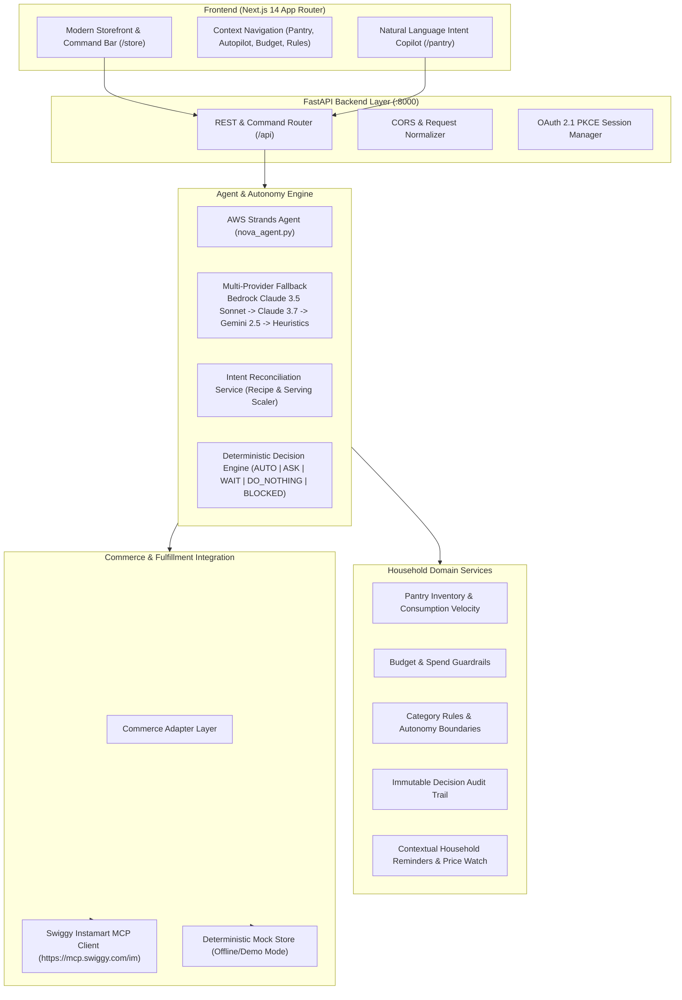

# NOVA — Household Autopilot
> **The intelligence layer for everyday commerce and household autonomy.**

NOVA transforms routine household replenishment from an active cognitive chore into an intelligent, autonomous background service. Built with **AWS Strands Agents**, **FastAPI**, **Next.js 14**, and native **Swiggy Instamart MCP** connectivity.

---

## 🧭 The Core Philosophy: Autonomy ≠ Automation

Most "smart shopping" tools simply automate repetitive clicks. NOVA operates under a fundamentally different paradigm: **true contextual autonomy**.

NOVA can:
- **ACT (`AUTO`)**: Replenish low-stock essentials automatically when strictly within user-approved budget limits and categories.
- **ASK (`ASK`)**: Explicitly request human confirmation when a product exceeds price limits, belongs to sensitive categories (e.g., electronics, new snack brands), or nears monthly budget ceilings.
- **WAIT (`WAIT`)**: Intelligently delay a purchase when a product's price is temporarily elevated and household pantry stock remains healthy.
- **RESTRAIN (`DO_NOTHING`)**: Intentionally choose *not* to purchase when pantry levels are ample, preventing pantry bloat and wasted capital.
- **BLOCK (`BLOCKED`)**: Enforce absolute household boundaries (e.g., alcohol, tobacco, restricted items) according to user policy.
- **RECONCILE INTENT**: Decompose natural meal requests (e.g., *"making chicken biryani for 6 people tonight"*) into ingredients, cross-reference the live pantry, and order *only* what is missing.

---

## 🏗️ System Architecture



---

## 🌟 The Three Hero Scenarios

### 1. Predictive Restock (`AUTO`)
- **Context**: Amul Taaza Milk stock is at 0.3L with an average daily consumption of 0.6L (~0.5 days remaining).
- **Evaluation**: Category (`Milk`) is marked as `automatic`, price is under the ₹500 auto-buy ceiling, and remaining monthly budget is sufficient.
- **Outcome**: NOVA automatically adds milk to the household replenishment cart and logs the decision with full mathematical justification.

### 2. Intelligent Restraint (`DO_NOTHING`)
- **Context**: The household regularly uses Fortune Sunflower Oil. Current pantry has 2.1L remaining, with daily consumption of 0.07L (~30 days remaining).
- **Evaluation**: The user asks NOVA to audit oil or the background autopilot inspects oil stock.
- **Outcome**: NOVA evaluates: *"You still have 2.1L in your pantry (~30 days of supply). No purchase needed."* Status: `DO_NOTHING`.

### 3. Intent Reconciliation (`RECONCILE`)
- **Context**: The user says: *"I want to make chicken biryani for 6 people tonight."*
- **Evaluation**: NOVA deconstructs the meal into core ingredients: Basmati Rice (scaled to 3.0kg), Biryani Masala (3 packs), Cooking Oil / Ghee (0.3L), and Curd/Dahi (1.2kg).
- **Pantry Cross-Check**: Cooking Oil is already ample in the pantry.
- **Outcome**: NOVA adds only the missing Basmati Rice, Biryani Masala, and Curd to the fulfillment cart, saving the user from duplicate purchases.

---

## 🚀 Quick Start Guide

### Prerequisites
- Python 3.10+ (tested on Python 3.13)
- Node.js 18+ (tested on Node.js 20/22)
- npm or yarn

### 1. Clone & Set Up Backend

```powershell
# Navigate to backend directory
cd backend

# Create and activate virtual environment
python -m venv venv
.\venv\Scripts\Activate.ps1   # On Linux/macOS: source venv/bin/activate

# Install dependencies
pip install -r requirements.txt

# Configure environment variables
cp ..\.env.example .env

# Start FastAPI server
uvicorn api.main:app --host 127.0.0.1 --port 8000 --reload
```

FastAPI server runs at `http://127.0.0.1:8000`. Interactive OpenAPI documentation available at `http://127.0.0.1:8000/docs`.

### 2. Set Up Frontend

```powershell
# Open a new terminal and navigate to frontend directory
cd frontend

# Install dependencies
npm install

# Start Next.js development server
npm run dev
```

Next.js frontend runs at `http://localhost:3000`.

---

## ⚙️ Environment Variables Reference

| Variable | Description | Default |
| :--- | :--- | :--- |
| `LLM_PROVIDER` | Active LLM driver (`bedrock`, `gemini`, `ollama`) | `gemini` |
| `GEMINI_API_KEY` | Google Gemini API key | Optional (uses heuristics if absent) |
| `GEMINI_MODEL` | Gemini model variant | `gemini-2.5-flash` |
| `AWS_REGION` | AWS Region for Bedrock / Strands | `us-east-1` |
| `BEDROCK_MODEL_ID` | Amazon Bedrock model ARN/ID | `anthropic.claude-3-5-sonnet-20241022-v2:0` |
| `COMMERCE_MODE` | Fulfillment connector (`live` or `mock`) | `live` |
| `SWIGGY_MCP_URL` | Upstream Swiggy Instamart MCP endpoint | `https://mcp.swiggy.com/im` |
| `SWIGGY_CLIENT_ID` | OAuth 2.1 client identifier | `swiggy-mcp` |
| `DEFAULT_AUTONOMY_PROFILE` | Autonomy stance (`FULL_AUTOPILOT`, `ASK_EVERYTHING`, `RESTRICTIVE`) | `FULL_AUTOPILOT` |
| `PORT` | Backend port | `8000` |

---

## 🧪 Automated Testing & Verification

NOVA includes a comprehensive automated test suite validating the entire autonomy pipeline:

```powershell
# Run complete backend pytest suite (21 tests)
cd d:\Projects\Nova
.\backend\venv\Scripts\python -m pytest backend/tests/ -v

# Run frontend TypeScript type checking (0 errors)
cd frontend
npx tsc --noEmit

# Run full Next.js production build (22/22 static pages prerendered)
npm run build
```

---

## 🎬 3-Minute Hackathon Demonstration Script

1. **Open Storefront (`http://localhost:3000/store`)**:
   - Showcase modern grocery shopping experience with real Indian grocery catalog.
   - Point out top navigation bar linking to all intelligence modules.
2. **Inspect Household Pantry (`/pantry`)**:
   - View live consumption velocity bars (Milk low at 0.3L, Sunflower Oil healthy at 2.1L).
   - Enter copilot command: *"I want to make biryani for 6 people tonight"*.
   - Watch NOVA deconstruct the recipe, verify oil is in the pantry, and suggest only missing rice and masala.
3. **Trigger Autopilot & Verify Restraint (`/autopilot`)**:
   - Run autonomous replenishment cycle.
   - Observe Amul Milk is ordered (`AUTO`), while Sunflower Oil is deliberately skipped (`DO_NOTHING`).
4. **Inspect Policy Guardrails & Activity Log (`/rules` & `/activity`)**:
   - Show how Alcohol & Tobacco are hard-restricted (`BLOCKED`).
   - Open `/activity` to review transparent audit cards detailing the *exact reasons* behind every autonomous decision.

---

## 📁 Repository Structure

```text
Nova/
├── backend/
│   ├── agent/             # AWS Strands Agent & Tool definitions
│   ├── ai/                # Gemini & LLM Provider integrations
│   ├── api/               # FastAPI endpoints, CORS, Request Models
│   ├── audit/             # Decision audit logging service
│   ├── autopilot/         # Monthly replenishment & scheduled sweeps
│   ├── budget/            # Monthly budget tracking & spending limits
│   ├── catalog/           # Product repository & taxonomy classification
│   ├── commerce/          # Swiggy Instamart OAuth 2.1 & Mock Commerce adapters
│   ├── decision/          # Decision Engine (AUTO, ASK, WAIT, DO_NOTHING, BLOCKED)
│   ├── images/            # Curated image resolver & Open Food Facts matching
│   ├── intent/            # Recipe deconstruction & serving scaler
│   ├── inventory/         # Pantry tracking & consumption velocity model
│   ├── policy/            # Category autonomy rules & restriction gates
│   ├── reminders/         # Smart household reminders & price watch
│   ├── scripts/           # Image ingestion & catalog verification scripts
│   └── tests/             # 21-test pytest suite (agent scenarios & hardening)
├── docs/                  # Architecture, security, demo, & hackathon docs
├── frontend/
│   ├── app/               # Next.js 14 App Router pages (22 routes)
│   ├── components/        # Storefront, Header, ProductCard, CommandBox
│   └── public/            # Static assets & brand logos
├── .env.example           # Documented configuration template
├── .gitignore             # Git ignore rules for node_modules, .next, venv, secrets
└── README.md              # Project overview & documentation
```

---

## 🛡️ Capability Preservation & Security

- **Preservation**: 100% of preexisting functional capabilities, routes, demo workflows, and seed data are verified and preserved.
- **Security**: No secrets or API credentials are committed. `.gitignore` strictly protects `.env`, `.env.local`, and `swiggy_session.json`.
- **Zero Push Guarantee**: Work strictly contained to local repository branch. No remote git push performed.

