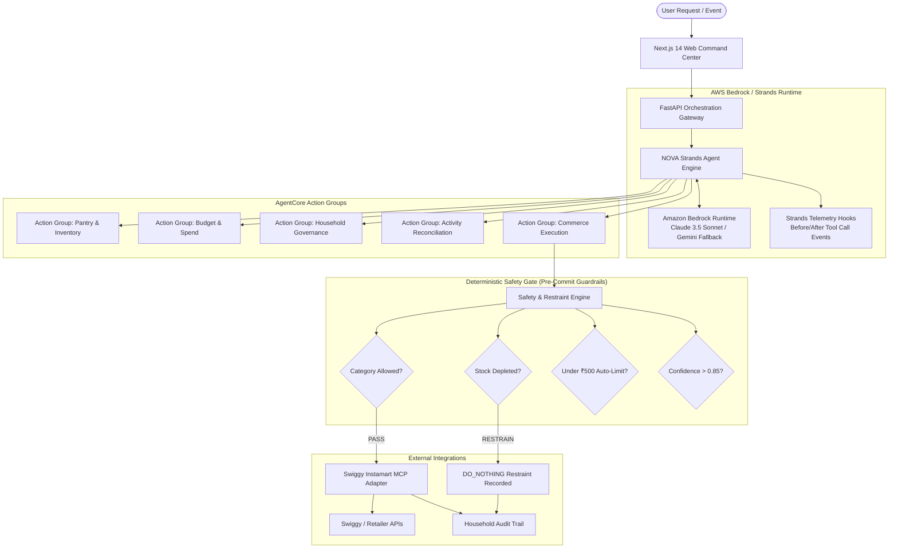

# NOVA - AWS Bedrock AgentCore Architecture Mapping

NOVA is a **confidence-aware autonomous household decision agent** built for the **AWS Agents for Humans Hackathon**. Rather than operating as an unrestricted conversational bot, NOVA enforces a strict deterministic safety gate between LLM reasoning and real-world execution.

This document formalizes how NOVA's components map directly to the **AWS Bedrock AgentCore** reference architecture.

---

## 1. High-Level Architecture Overview

---

## 2. Bedrock AgentCore Component Mapping

| AWS Bedrock AgentCore Concept | NOVA Implementation | Implementation Details |
| :--- | :--- | :--- |
| **Foundation Model Runtime** | `backend/agent/nova_agent.py` (`BedrockModel` & `GeminiModel`) | Multi-provider factory supporting `LLM_PROVIDER=bedrock` (Amazon Bedrock Anthropic Claude) and `LLM_PROVIDER=gemini`, orchestrated via the AWS Strands Agent SDK. |
| **Agent Action Groups** | `backend/agent/tools.py` | 10 registered Strands tools exposed as structured schemas with explicit typing, input validation, and execution handlers. |
| **Pre-execution Guardrails** | `backend/decision/decision_service.py` (`DecisionEngine`) | Deterministic pre-commit gate verifying category restrictions, inventory sufficiency, auto-buy limits (₹500), and remaining monthly budget before any purchase can proceed. |
| **Restraint & Prudence Gate** | `record_restraint_decision` + `DecisionEngine` | Autonomous `DO_NOTHING` verdict when pantry stock is healthy, preventing duplicate and wasteful purchases. |
| **Session Memory & Context** | `backend/user/session_service.py` & `backend/inventory/inventory_service.py` | Persistent household state, current autonomy profile (`FULL_AUTOPILOT`), active reminders, and pantry stock levels. |
| **External Service Integration** | `backend/commerce/swiggy_adapter.py` | Model Context Protocol (MCP) client interacting with quick-commerce providers (catalog search, cart updates, simulated checkout). |
| **Audit & Telemetry Logging** | `backend/audit/audit_service.py` + Strands `AfterToolCallEvent` | Every tool execution, purchase verdict, and restraint decision is timestamped and recorded for complete household transparency. |

---

## 3. Action Groups Detail

### Action Group 1: Pantry & Inventory (`AG_Pantry`)
* **`get_pantry_inventory`**: Inspects pantry stock, remaining quantity, consumption rates, and days of supply.
* **`get_purchase_history`**: Analyzes historical intervals and predicted replenishment urgency.
* **`get_household_overview`**: Synthesizes a unified health score of budget, stock levels, and savings opportunities.

### Action Group 2: Budget & Policy Governance (`AG_Governance`)
* **`get_budget_status`**: Enforces financial boundaries (monthly budget, current spend, single-purchase auto-limits).
* **`check_category_policy`**: Classifies product categories into `AUTOMATIC`, `REQUIRES_APPROVAL` (`ASK`), or `RESTRICTED` (`BLOCKED`).

### Action Group 3: Intent Reconciliation (`AG_Intent`)
* **`reconcile_activity_requirements`**: Decomposes high-level human intents (e.g., *"I want to make Maggi tonight"*) into atomic ingredient requirements. Checks real pantry inventory to determine which items already exist and prevents buying redundant stock.

### Action Group 4: Commerce & Restraint Execution (`AG_Execution`)
* **`search_catalog`**: Queries live retailer catalog via Swiggy Instamart MCP with automatic local catalog failover.
* **`compare_product_offers`**: Evaluates multi-retailer pricing and delivery speed.
* **`record_restraint_decision`**: Explicitly logs an autonomous decision NOT to buy an item when inventory is healthy.
* **`evaluate_and_execute_purchase`**: Executes the end-to-end deterministic safety verification and submits simulated orders.

---

## 5. Telemetry & Front-End Trace Mounting

The Next.js frontend interfaces directly with NOVA via the unified `<CommandBox />` component:
* **Real-time Trace Cards**: Each Strands tool invocation generates a trace event with tool name, execution latency, and formatted result payload.
* **Autonomy Verdict Badges**: Visual indicators for `AUTO`, `DO_NOTHING`, `ASK`, `WAIT`, and `BLOCKED`.
* **Dynamic State Propagation**: Emits `household-updated` DOM events upon tool execution to automatically trigger reactive re-fetching in pantry, budget, and storefront views.
